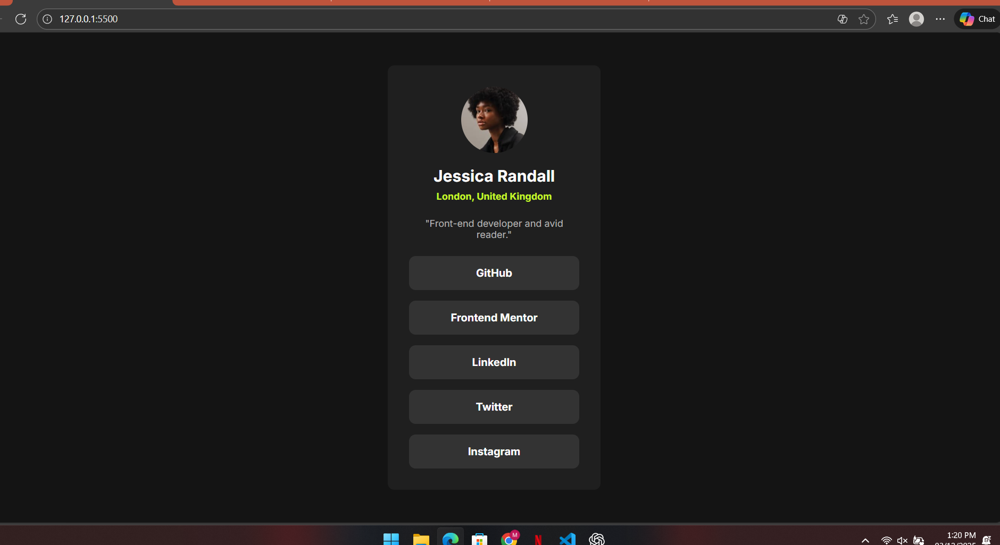

# Frontend Mentor - Social links profile solution

This is my solution to the **Social links profile** challenge on Frontend Mentor.

## 🧩 Overview

Users should be able to:

- See hover and focus states for all interactive elements
- View the optimal layout depending on their device's screen size

## 📸 Screenshot

## 🔗 Links

- Solution URL: (https://github.com/Mano6383/fm-social-links-profile)
- Live Site URL: (https://sweet-taffy-a9d744.netlify.app/)

## 🛠️ Built with

- Semantic HTML5 markup  
- CSS Flexbox  
- Mobile-first workflow  
- Custom styling inspired by design files

## 📚 What I learned

- How to center content using `flex`
- How to use hover transitions
- How to style user profile cards
- Proper folder structure for Frontend Mentor challenges

## 🚀 Useful resources

- [MDN Flexbox Guide](https://developer.mozilla.org/en-US/docs/Learn/CSS/CSS_layout/Flexbox)
- [Frontend Mentor](https://www.frontendmentor.io)

## 👨‍💻 Author

- Frontend Mentor – https://www.frontendmentor.io/profile/Mano6383
- GitHub – https://github.com/Mano6383
